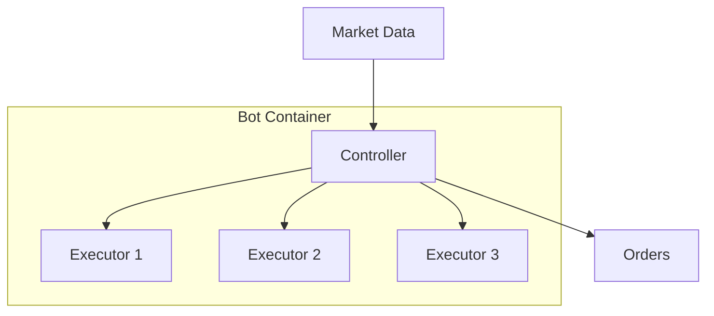

**Controllers** are V2 strategy components that implement algorithmic trading logic. They run inside bot containers and manage complex, multi-step trading strategies by creating and supervising executors.

## What Are Controllers?

Controllers are Python classes that:
- Define trading strategy logic
- Process market data into a signal
- Create and manage executors
- Expose status and custom metrics



A single bot can run **multiple controllers** at once — each targeting a different market — within one container.

## Built-in Controllers

Controllers ship under three `controller_type` categories. A selection of the built-ins:

| `controller_type` | Controller (`controller_name`) | Description |
|-------------------|--------------------------------|-------------|
| `market_making` | `pmm_simple` | Two-sided market making with fixed spreads |
| `market_making` | `pmm_dynamic` | Market making with spreads driven by volatility |
| `directional_trading` | `bollinger_v1` | Bollinger Bands trend signal |
| `directional_trading` | `dman_v3` | Multi-level directional strategy |
| `directional_trading` | `macd_bb_v1` | MACD + Bollinger Bands signal |
| `generic` | `grid_strike` | Grid of orders across a price range |
| `generic` | `arbitrage_controller` | Cross-exchange arbitrage |
| `generic` | `xemm_multiple_levels` | Cross-exchange market making |
| `generic` | `pmm_mister` | Market making with position hold and profit protection |

<Note>
`directional_trading`, `market_making`, and `generic` are controller **types**, not controller names. The exact set of built-ins tracks the [Hummingbot repository](https://github.com/hummingbot/hummingbot/tree/development/controllers) — browse `controllers/` for the current list.
</Note>

## Controller Structure

A controller overrides two core methods from `ControllerBase`:

- **`update_processed_data()`** — pull market data and compute a signal into `self.processed_data`
- **`determine_executor_actions()`** — decide which executors to create or stop

The specialized base classes `DirectionalTradingControllerBase` and `MarketMakingControllerBase` already implement `determine_executor_actions()` for you, so trend and market-making controllers typically only implement `update_processed_data()` and `get_candles_config()`.

This is the actual `bollinger_v1` directional controller:

```python
from typing import List

from hummingbot.data_feed.candles_feed.data_types import CandlesConfig
from hummingbot.strategy_v2.controllers.directional_trading_controller_base import (
    DirectionalTradingControllerBase,
    DirectionalTradingControllerConfigBase,
)


class BollingerV1ControllerConfig(DirectionalTradingControllerConfigBase):
    controller_name: str = "bollinger_v1"
    interval: str = "3m"
    bb_length: int = 100
    bb_std: float = 2.0
    bb_long_threshold: float = 0.0
    bb_short_threshold: float = 1.0


class BollingerV1Controller(DirectionalTradingControllerBase):
    def __init__(self, config: BollingerV1ControllerConfig, *args, **kwargs):
        self.config = config
        self.max_records = config.bb_length
        super().__init__(config, *args, **kwargs)

    def get_candles_config(self) -> List[CandlesConfig]:
        return [CandlesConfig(
            connector=self.config.candles_connector,
            trading_pair=self.config.candles_trading_pair,
            interval=self.config.interval,
            max_records=self.max_records,
        )]

    async def update_processed_data(self):
        df = self.market_data_provider.get_candles_df(
            connector_name=self.config.candles_connector,
            trading_pair=self.config.candles_trading_pair,
            interval=self.config.interval,
            max_records=self.max_records,
        )
        df.ta.bbands(length=self.config.bb_length, std=self.config.bb_std, append=True)
        bbp = df[f"BBP_{self.config.bb_length}_{self.config.bb_std}"]

        df["signal"] = 0
        df.loc[bbp < self.config.bb_long_threshold, "signal"] = 1
        df.loc[bbp > self.config.bb_short_threshold, "signal"] = -1

        self.processed_data["signal"] = df["signal"].iloc[-1]
        self.processed_data["features"] = df
```

Market data comes from `self.market_data_provider` (e.g. `get_candles_df(...)`, `get_price_by_type(...)`), not from ad-hoc fetches.

## Controller Configuration

Each controller instance is configured by a YAML file. This is a real `pmm_simple` config:

```yaml
id: pmm_simple_hype
controller_name: pmm_simple
controller_type: market_making
total_amount_quote: '100'
connector_name: hyperliquid
trading_pair: HYPE-USDC
buy_spreads:
- 0.001
sell_spreads:
- 0.001
buy_amounts_pct:
- '1'
sell_amounts_pct:
- '1'
executor_refresh_time: 60
cooldown_time: 15
leverage: 1
position_mode: HEDGE
stop_loss: '0.005'
take_profit: '0.002'
time_limit: 2700
```

## Deploying a Controller

The usual flow is: create one or more controller configs (in the dashboard **Editor**, in Telegram, or via the API), then deploy a bot that runs them.

### Via Telegram

```
/bots → Create New Bot
→ Select one or more controller configs
→ Deploy
```

### Via API

Deploy a bot from existing controller config files (without the `.yml` extension). You can pass several configs to run multiple controllers in one bot:

```bash
curl -u admin:admin -X POST http://localhost:8000/bot-orchestration/deploy-v2-controllers \
  -H "Content-Type: application/json" \
  -d '{
    "instance_name": "hype-mm",
    "credentials_profile": "master_account",
    "controllers_config": ["conf_market_making.pmm_simple_hype"],
    "max_global_drawdown_quote": 50,
    "max_controller_drawdown_quote": 25
  }'
```

## Updating a Running Controller

Controllers can be reconfigured while running — no restart required. Only fields a controller marks as updatable are applied; everything else (for example, the connector name) is ignored on update.

A config field is made updatable with `json_schema_extra`:

```python
from pydantic import Field

total_amount_quote: Decimal = Field(
    default=Decimal("100"),
    json_schema_extra={"is_updatable": True},
)
```

At runtime, `ControllerBase.update_config(new_config)` copies over only the fields flagged `is_updatable`. In Condor, push a live update from the dashboard **Bots → Active** tab by editing the config and saving.

## Custom Controller Metrics

Override `get_custom_info()` to publish controller-specific fields alongside the standard performance report. The payload is sent over MQTT to the Hummingbot API, so keep it small (recommended < 1 KB):

```python
def get_custom_info(self) -> dict:
    return {"inventory_pct": float(self.current_inventory_pct)}
```

These fields are stored with each controller snapshot and surfaced per controller in the dashboard.

## Creating Custom Controllers

1. Create a new Python file under `controllers/` (in the matching `controller_type` subfolder)
2. Subclass the appropriate base — `ControllerBase`, `DirectionalTradingControllerBase`, or `MarketMakingControllerBase`
3. Implement `update_processed_data()` (and `determine_executor_actions()` if you subclass `ControllerBase` directly)
4. Add a config file and deploy it

Custom controllers run in stock Hummingbot too, and can be uploaded directly from the dashboard Editor.

## Monitoring Controllers

The Hummingbot API records a snapshot of every running controller every 5 minutes, giving you a time series of P&L and volume rather than a single point in time.

```bash
# Latest snapshot per controller
curl -u admin:admin "http://localhost:8000/bot-orchestration/controller-performance-latest?bot_name=hype-mm"

# Time-series history (interval one of 5m, 15m, 30m, 1h, 4h, 12h, 1d)
curl -u admin:admin "http://localhost:8000/bot-orchestration/controller-performance-history?bot_name=hype-mm&controller_id=pmm_simple_hype&interval=5m"
```

In Condor, view this history under **Bots → Runs**, and the combined P&L across a bot's controllers under **Bots → Active**.
