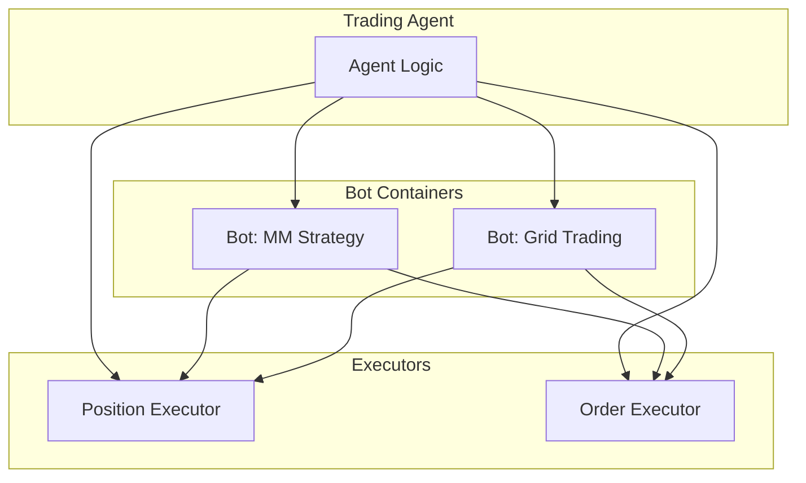

**Bots** are Docker containers running Hummingbot instances for long-running automation tasks. They execute [Scripts](/bots/scripts) for simpler tasks or [Controllers](/bots/controllers) for algorithmic trading strategies.

## Bots vs Executors

| Aspect | Executors | Bots |
|--------|-----------|------|
| **Lifecycle** | Short-lived (minutes to hours) | Long-running (days to weeks) |
| **Scope** | Single operation | Complex strategies |
| **Control** | Agent-controlled | Autonomous or supervised |
| **Use Case** | Individual trades | Continuous market making |



## When to Use Bots

| Scenario | Use | Reason |
|----------|-----|--------|
| Single directional trade | Executor | Short-lived, defined outcome |
| Continuous market making | Bot | Long-running, complex logic |
| One-time swap | Executor | Simple, immediate |
| Multi-leg arbitrage | Bot | Requires coordination |
| LP position with time limit | Executor | Self-contained lifecycle |
| 24/7 grid trading | Bot | Persistent, adaptive |

## Bot Lifecycle

### Creation

Create a bot via Telegram or API:

**Telegram**:
```
/bots → Create New Bot → Select one or more controller configs
```

**API**: Deploy a bot from existing controller config files (without `.yml`). Pass several configs to run multiple controllers in one bot:
```bash
curl -u admin:admin -X POST http://localhost:8000/bot-orchestration/deploy-v2-controllers \
  -H "Content-Type: application/json" \
  -d '{
    "instance_name": "my-market-maker",
    "credentials_profile": "master_account",
    "controllers_config": ["conf_market_making.pmm_simple_1"]
  }'
```

### Starting and Stopping

**Telegram**:
```
/bots → Select bot → Start/Stop
```

**API**: Start and stop take the bot name in the request body.
```bash
# Start
curl -u admin:admin -X POST http://localhost:8000/bot-orchestration/start-bot \
  -H "Content-Type: application/json" -d '{"bot_name": "my-market-maker"}'

# Stop
curl -u admin:admin -X POST http://localhost:8000/bot-orchestration/stop-bot \
  -H "Content-Type: application/json" -d '{"bot_name": "my-market-maker"}'

# Stop and archive
curl -u admin:admin -X POST http://localhost:8000/bot-orchestration/stop-and-archive-bot/my-market-maker
```

### Monitoring

**Telegram**: `/bots` shows:
- Bot status (running/stopped)
- Uptime and resource usage
- Recent P&L
- Active orders and positions

**API**:
```bash
# Status of all bots
curl -u admin:admin http://localhost:8000/bot-orchestration/status

# Status of a single bot
curl -u admin:admin http://localhost:8000/bot-orchestration/my-market-maker/status
```

The Hummingbot API also records a snapshot of every running controller every 5 minutes, so you get a time series of P&L and volume rather than a single point. Query it with `/bot-orchestration/controller-performance-history` (see [Monitoring Controllers](/bots/controllers#monitoring-controllers)), or view it in Condor under **Bots → Runs**. When a bot runs multiple controllers, **Bots → Active** charts their combined P&L with toggles to isolate each one.

### Logs

**Telegram**:
```
/bots → Select bot → View Logs
```

Each bot runs in its own Docker container, so you can also read logs directly:
```bash
docker logs hummingbot-my-market-maker
```

## Container Isolation

Each bot runs in an isolated Docker container:

- Separate filesystem
- Independent network
- Own log streams
- Can be started/stopped individually

```bash
# List bot containers
docker ps --filter "name=hummingbot"

# View container logs
docker logs hummingbot-my-market-maker
```

## Integration with Agents

Agents can deploy and manage bots programmatically:

The `manage_bots` MCP tool handles the full lifecycle through a single `action` parameter (`deploy`, `status`, `logs`, `stop_bot`, `start_controllers`, `stop_controllers`, `get_config`, `update_config`):

```python
# Agent deploys a bot from one or more controller configs
result = await mcp_tools.manage_bots(
    action="deploy",
    bot_name="eth-mm",
    controllers_config=["conf_market_making.pmm_simple_1"],
)

# Agent checks bot status
status = await mcp_tools.manage_bots(action="status", bot_name="eth-mm")
```
