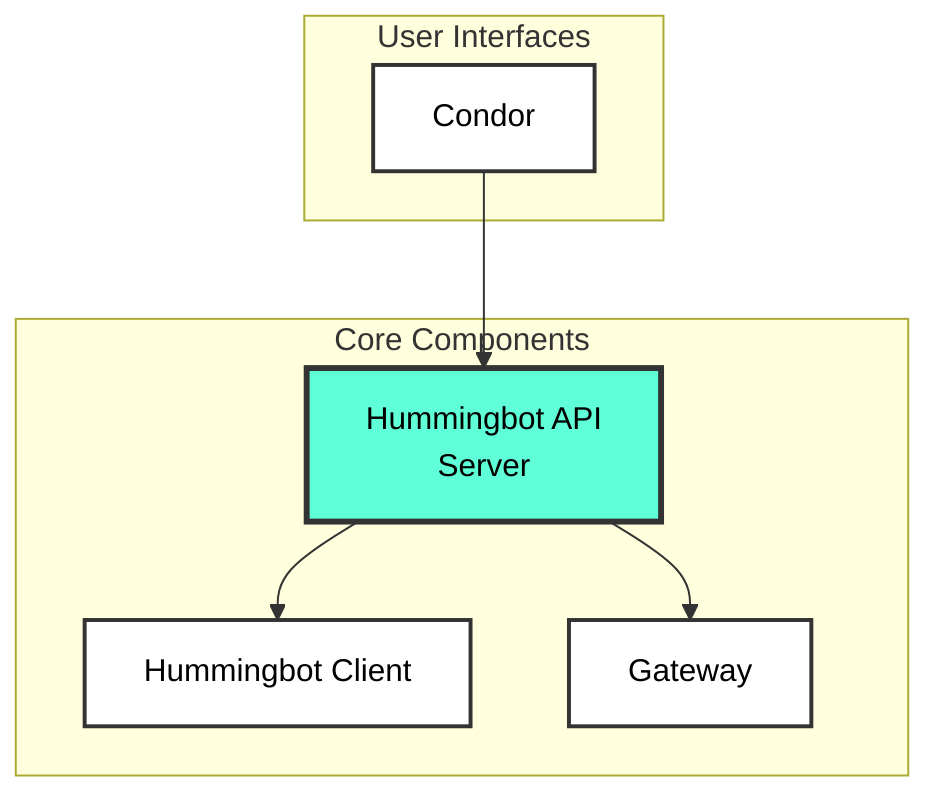

The Hummingbot ecosystem consists of several repositories that work together to provide a complete algorithmic trading platform. This page provides an overview of each component and links to their installation guides.

## Hummingbot Ecosystem

## Repository Overview

| Repository | Description | Quickstart | Source Install |
|------------|-------------|------------|----------------|
| **[Hummingbot API](https://github.com/hummingbot/hummingbot-api)** | REST API backend for managing bots, portfolios, and trading | [via Condor](/condor/getting-started/installing) | [Source](/documentation/hummingbot-api/installation) |
| **[Hummingbot Client](https://github.com/hummingbot/hummingbot)** | Core trading client with CLI interface for CEX trading | [Quickstart](/documentation/client/installation) | [Source](/documentation/client/installation) |
| **[Gateway](https://github.com/hummingbot/gateway)** | DEX middleware for Uniswap, PancakeSwap, Raydium, and 30+ DEXs | - | [Installation](/documentation/gateway/installation) |
| **[Condor](https://github.com/hummingbot/condor)** | Telegram bot for monitoring and controlling Hummingbot instances | [Quickstart](/condor/getting-started/installing) | [Docs](/condor/introduction) |
| **[Deploy](https://github.com/hummingbot/deploy)** | Deployment scripts and tooling, including the Condor install script | - | [GitHub](https://github.com/hummingbot/deploy) |
| **[Quants Lab](https://github.com/hummingbot/quants-lab)** | Research environment for backtesting and strategy analysis | - | [GitHub](https://github.com/hummingbot/quants-lab) |
